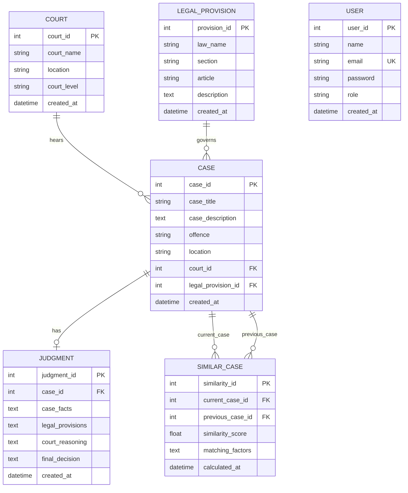

# LegalPrecedent - Legal Case Research Assistance Platform (Backend)

**LegalPrecedent** is a legal research assistance backend platform developed in **Python** using **FastAPI**, **SQLAlchemy**, **PyMySQL**, **Pydantic**, and **scikit-learn**.

A lawyer or legal researcher enters the details of a current legal case in simple language. The backend validates and stores the case, extracts key case factors, searches historical precedent cases, calculates multi-factor similarity scores (combining TF-IDF cosine similarity for case facts with offence, location, court, and statutory provision factors), ranks relevant precedents, and retrieves full judgment information for immediate presentation to the user.

> [!NOTE]
> **Academic & Prototyping Disclaimer**:
> This platform is intended strictly for legal research assistance and demonstration. It uses sample/demo data and does **NOT** replace professional legal judgment, nor does it claim to contain the complete legal database of India.

---

## 🛠️ Technology Stack

- **Framework**: [FastAPI](https://fastapi.tiangolo.com/) (High-performance modern Python web framework)
- **Database**: [MySQL](https://www.mysql.com/) 8.0+
- **ORM & Connectivity**: [SQLAlchemy](https://www.sqlalchemy.org/) 2.0+ & [PyMySQL](https://pymysql.readthedocs.io/)
- **Data Validation & Schemas**: [Pydantic v2](https://docs.pydantic.dev/)
- **Environment Management**: [python-dotenv](https://github.com/theskumar/python-dotenv) & [pydantic-settings](https://github.com/pydantic/pydantic-settings)
- **Machine Learning & Text Similarity**: [scikit-learn](https://scikit-learn.org/) (TF-IDF Vectorizer + Cosine Similarity) & [NumPy](https://numpy.org/)
- **ASGI Server**: [Uvicorn](https://www.uvicorn.org/)

---

## 📁 Project Directory Structure

```
LegalPrecedent_Backend/
│
├── app/
│   ├── __init__.py                 # App package initialization
│   ├── main.py                     # FastAPI application entry point, CORS, lifespan & error handlers
│   ├── config.py                   # Pydantic Settings & environment variable configuration
│   ├── database.py                 # SQLAlchemy engine, SessionLocal, Base & get_db dependency
│   │
│   ├── models/                     # SQLAlchemy Database Models
│   │   ├── __init__.py
│   │   ├── user.py                 # User table (Lawyer, Researcher, Student, Firm, Intern)
│   │   ├── court.py                # Court table (Supreme Court, High Court, District Court)
│   │   ├── legal_provision.py      # Legal Provision table (BNS sections, Constitution Articles)
│   │   ├── case.py                 # Case table (facts, offence, location, foreign keys)
│   │   ├── judgment.py             # Judgment table (facts, reasoning, final decision)
│   │   └── similar_case.py         # Similar Case table (scores, matching factors)
│   │
│   ├── schemas/                    # Pydantic Request/Response Schemas
│   │   ├── __init__.py
│   │   ├── user.py                 # UserCreate, UserResponse, UserLogin
│   │   ├── court.py                # CourtCreate, CourtResponse
│   │   ├── legal_provision.py      # LegalProvisionCreate, LegalProvisionResponse
│   │   ├── case.py                 # CaseCreate, CaseResponse, CaseDetailResponse
│   │   ├── judgment.py             # JudgmentCreate, JudgmentResponse
│   │   └── similar_case.py         # SimilarCaseResultItem, CaseSimilarityAnalysisResponse
│   │
│   ├── routes/                     # FastAPI API Route Handlers
│   │   ├── __init__.py
│   │   ├── users.py                # POST /users/register, GET /users/{id}, POST /users/login
│   │   ├── courts.py               # POST /courts, GET /courts, GET /courts/{id}
│   │   ├── legal_provisions.py     # POST /legal-provisions, GET /legal-provisions
│   │   ├── cases.py                # POST /cases, GET /cases, PUT /cases/{id}, DELETE /cases/{id}
│   │   ├── judgments.py            # POST /judgments, GET /judgments/{id}, GET /cases/{id}/judgment
│   │   └── similar_cases.py        # GET /cases/{id}/similar, GET /similar-cases
│   │
│   └── services/                   # Business Logic & Similarity Engine
│       ├── __init__.py
│       └── similarity.py           # Multi-factor TF-IDF Cosine Similarity calculation & ranking
│
├── seed_data.py                    # Demo database populator script with realistic precedents
├── test_backend.py                 # Comprehensive automated backend test suite
├── database.sql                    # Pure MySQL DDL schema script
├── requirements.txt                # Python package dependencies
├── .env.example                    # Template environment variables file
├── .env                            # Active environment configuration
├── .gitignore                      # Git ignored files
└── README.md                       # Comprehensive project documentation
```

---

## 🗄️ Database Tables & Architecture



---

## ⚙️ Step-by-Step Installation & Setup

### 1. Prerequisites
- **Python 3.10+** (Tested on Python 3.13)
- **MySQL 8.0+** (or MariaDB) installed and running on port 3306

### 2. Install MySQL Database
If you do not have MySQL installed:
- **Windows**: Download and install [MySQL Community Server](https://dev.mysql.com/downloads/mysql/) or [XAMPP](https://www.apachefriends.org/).
- Ensure the MySQL service is started (e.g. via Windows Services or XAMPP Control Panel).

### 3. Create the MySQL Database
Log in to MySQL using MySQL Workbench, phpMyAdmin, or the MySQL command line:
```sql
CREATE DATABASE legalprecedent_db CHARACTER SET utf8mb4 COLLATE utf8mb4_unicode_ci;
```
*(Alternatively, execute the full `database.sql` script provided in the project folder).*

### 4. Configure `.env`
Copy `.env.example` to `.env` and fill in your MySQL credentials:
```env
DB_HOST=localhost
DB_PORT=3306
DB_NAME=legalprecedent_db
DB_USER=root
DB_PASSWORD=your_mysql_password
```

### 5. Install Python Dependencies
Open your terminal in the project root directory and run:
```bash
pip install -r requirements.txt
```

### 6. Seed Demo Data
Populate the database with demo courts, statutory provisions, users, realistic precedent cases, and judgments:
```bash
python seed_data.py
```

### 7. Run the FastAPI Server
Start the backend server with hot-reloading:
```bash
uvicorn app.main:app --reload --host 127.0.0.1 --port 8000
```

The server will start at: `http://127.0.0.1:8000`

---

## 📖 API Documentation & Swagger UI

FastAPI automatically generates interactive visual documentation:
- **Interactive Swagger UI**: [http://127.0.0.1:8000/docs](http://127.0.0.1:8000/docs)
- **ReDoc UI**: [http://127.0.0.1:8000/redoc](http://127.0.0.1:8000/redoc)
- **OpenAPI JSON Spec**: [http://127.0.0.1:8000/openapi.json](http://127.0.0.1:8000/openapi.json)

---

## 🚀 API Endpoints Reference

### 1. General Endpoints
| Method | Endpoint | Description |
|---|---|---|
| `GET` | `/` | API status, metadata, version, and disclaimer |
| `GET` | `/health` | Live database connection and system health check |

### 2. User APIs
| Method | Endpoint | Description |
|---|---|---|
| `POST` | `/users/register` | Register a new user (Lawyer, Researcher, Student, etc.) |
| `POST` | `/users/login` | Verify user login credentials |
| `GET` | `/users/{user_id}` | Retrieve user profile by ID |
| `GET` | `/users` | List all registered users |

### 3. Court APIs
| Method | Endpoint | Description |
|---|---|---|
| `POST` | `/courts` | Register a new court (Supreme Court, High Court, etc.) |
| `GET` | `/courts` | Retrieve list of all courts |
| `GET` | `/courts/{court_id}` | Retrieve court details by ID |

### 4. Legal Provision APIs
| Method | Endpoint | Description |
|---|---|---|
| `POST` | `/legal-provisions` | Add a legal provision (BNS sections, Constitutional Articles) |
| `GET` | `/legal-provisions` | List legal provisions (with optional law name filter) |
| `GET` | `/legal-provisions/{provision_id}` | Retrieve specific provision details |

### 5. Case APIs
| Method | Endpoint | Description |
|---|---|---|
| `POST` | `/cases` | Create a new case with description, offence, location, court, and provision |
| `GET` | `/cases` | List all cases (with optional offence/location/court filtering) |
| `GET` | `/cases/{case_id}` | Retrieve case details with nested court and provision info |
| `PUT` | `/cases/{case_id}` | Update existing case information |
| `DELETE` | `/cases/{case_id}` | Delete a case |
| `GET` | `/cases/{case_id}/similar` | **Compute similarity, rank precedents, identify matching factors, and retrieve judgments** |

### 6. Judgment APIs
| Method | Endpoint | Description |
|---|---|---|
| `POST` | `/judgments` | Add a judgment for an existing case |
| `GET` | `/judgments` | List all judgments |
| `GET` | `/judgments/{judgment_id}` | Get judgment by Judgment ID |
| `GET` | `/cases/{case_id}/judgment` | Retrieve judgment specifically for a given Case ID |

### 7. Similar Cases History APIs
| Method | Endpoint | Description |
|---|---|---|
| `GET` | `/similar-cases` | List stored historical similarity calculation records |
| `GET` | `/similar-cases/{similarity_id}` | Get specific similarity computation record |

---

## 🧠 How the Similarity Scoring Engine Works

The similarity engine in `app/services/similarity.py` uses a clear, explainable multi-factor scoring formula tailored for legal case comparison:

$$\text{Composite Score} = (0.45 \times S_{\text{facts}}) + (0.25 \times S_{\text{offence}}) + (0.15 \times S_{\text{provision}}) + (0.10 \times S_{\text{court}}) + (0.05 \times S_{\text{location}}) \times 100$$

### Weight Breakdown:
1. **Case Description / Facts (45% Weight)**:
   - Uses `scikit-learn`'s `TfidfVectorizer` (with English stop words removal) and `cosine_similarity`.
   - Compares the natural language scenario entered by the lawyer with historical precedent facts.
2. **Offence Comparison (25% Weight)**:
   - Checks exact offence matches and Jaccard token overlap for related offences (e.g. *Theft* vs *Vehicle Theft*).
3. **Legal Provision (15% Weight)**:
   - Checks matching statutory sections (e.g. *BNS Section 303*) or Articles (*Article 21*).
4. **Court Hierarchy (10% Weight)**:
   - Matches specific court or judicial hierarchy level (*Supreme Court*, *High Court*, *District Court*).
5. **Geographical Location (5% Weight)**:
   - Matches jurisdictional territory (e.g., *New Delhi*, *Mumbai*, *Bengaluru*).

### Example Response from `GET /cases/{case_id}/similar`:
```json
{
  "current_case_id": 15,
  "current_case_title": "Commercial Warehouse Electronics Break-in",
  "current_offence": "Theft",
  "current_location": "New Delhi",
  "current_court": "High Court of Delhi",
  "current_legal_provision": "Bharatiya Nyaya Sanhita (BNS) (Section 303)",
  "total_precedents_evaluated": 8,
  "total_matches_found": 3,
  "similar_cases": [
    {
      "previous_case_id": 1,
      "case_title": "State v. Ramesh Kumar (Demo Precedent)",
      "case_description": "The accused broke into a locked commercial warehouse at night and dishonestly took electronic goods worth 5 lakhs...",
      "offence": "Theft",
      "location": "New Delhi",
      "court_name": "High Court of Delhi",
      "court_level": "High Court",
      "legal_provision": "Bharatiya Nyaya Sanhita (BNS) (Section 303)",
      "similarity_score": 87.5,
      "similarity_percentage": "87.5%",
      "matching_factors": [
        "Similar case facts (TF-IDF similarity: 72.3%)",
        "Exact matching offence: 'Theft'",
        "Same legal provision: Bharatiya Nyaya Sanhita (BNS) Section 303",
        "Same court: 'High Court of Delhi'",
        "Same jurisdictional location: 'New Delhi'"
      ],
      "judgment": {
        "Judgment_ID": 1,
        "Case_ID": 1,
        "Case_Facts": "On the night of 12th January, the accused Ramesh Kumar entered the complainant's warehouse...",
        "Legal_Provisions": "Bharatiya Nyaya Sanhita Section 303 (Theft in building/warehouse).",
        "Court_Reasoning": "Recovery of stolen property under discovery memos and corroborating forensic evidence...",
        "Final_Decision": "Accused found guilty of theft and sentenced to 2 years rigorous imprisonment along with a fine of Rs. 25,000.",
        "Created_At": "2026-08-27T11:00:00Z"
      }
    }
  ]
}
```

---

## 🧪 Automated Testing

To run the complete automated test suite verifying all routes, models, schemas, and similarity algorithms:
```bash
python test_backend.py
```

Expected output:
```
==================================================
Running LegalPrecedent Backend Test Suite...
==================================================
[PASS] Root Endpoint
[PASS] Health Endpoint
[PASS] User Registration, Login & Duplicates
[PASS] Court Endpoints
[PASS] Legal Provision Endpoints
[PASS] Case, Judgment & Multi-factor Similarity Flow
[PASS] Similarity Unit Logic
==================================================
Results: 7/7 tests passed successfully!
==================================================
```

---

## 🛡️ Error Handling & Validation

- **Pydantic Validation**: Automatically intercepts missing fields, invalid email structures, and illegal data types with `422 Unprocessable Entity`.
- **Duplicate Prevention**: Email collisions during registration return `400 Bad Request`.
- **Foreign Key Validation**: Attempting to create a Case with a non-existent `Court_ID` or `Legal_Provision_ID` returns `404 Not Found`.
- **Duplicate Judgments**: Attempting to attach multiple judgments to a single case returns `400 Bad Request`.
- **Graceful Fallbacks**: Connection errors return clear troubleshooting guidance.
